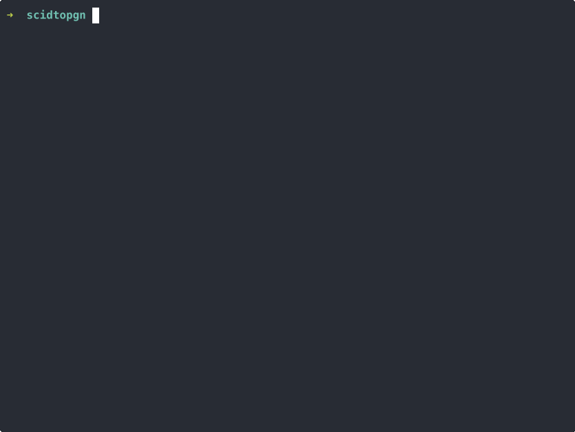

A Rust library and CLI for converting between SCID (.si4/.sn4/.sg4) and PGN formats. Fast, accurate, and functional on Windows, Mac, and Linux.



## Quick start (CLI)

> [!CAUTION]
> This library is still in beta; you must build it from source. For now! Once some additional testing has been done, you'll be able to download it separately.

```bash
# build it
cargo build --release

# dump a SCID database to PGN
scidtopgn /path/to/database

# save it to a file
scidtopgn /path/to/database -o output.pgn

# go the other direction — PGN into a fresh SCID database
scidtopgn import games.pgn -o mydb
```

> [!NOTE]
> Specify database paths *without* extensions — use `mydb`, not `mydb.si4`.

## CLI usage

### Export (SCID → PGN)

```bash
scidtopgn /path/to/database              # stdout
scidtopgn /path/to/database -o out.pgn   # to file
scidtopgn /path/to/database --count      # just tell me how many games
scidtopgn export /path/to/database       # explicit subcommand, same thing
```

#### Export arguments

| Argument | Short | Required | Default | Description |
|----------|-------|----------|---------|-------------|
| `database` | - | Yes | - | Path to SCID database (without file extension) |
| `--output` | `-o` | No | stdout | Output file path |
| `--count` | - | No | - | Just print the number of games and exit |
| `--overwrite` | - | No | - | Overwrite the output file if it already exists |
| `--verbose` | `-v` | No | - | Verbose output |

### Import (PGN → SCID)

```bash
scidtopgn import games.pgn -o mydb               # create or append
scidtopgn import games.pgn -o mydb --overwrite    # start fresh
scidtopgn import - -o mydb                        # read from stdin
scidtopgn import games.pgn -o mydb --on-error=abort  # strict mode
```

By default, import appends to an existing database. Bad games get skipped with a warning unless you pass `--on-error=abort`.

#### Import arguments

| Argument | Short | Required | Default | Description |
|----------|-------|----------|---------|-------------|
| `pgn_file` | - | Yes | - | PGN file to import (use `-` for stdin) |
| `--output` | `-o` | Yes | - | Output database path (without file extension) |
| `--overwrite` | - | No | - | Overwrite existing database instead of appending |
| `--on-error` | - | No | `skip` | Error handling strategy: `skip` or `abort` |
| `--verbose` | `-v` | No | - | Verbose output |

## Use it as a library

```rust
use scidtopgn::Database;

let mut db = Database::open("path/to/database")?;

for game in db.games() {
    let game = game?;
    println!("{}", game.to_pgn());
}

// or grab a specific game
let game = db.get_game(0)?;
println!("{} vs {}", game.white, game.black);
```

## Building & testing

```bash
cargo build              # debug
cargo build --release    # optimized
cargo test --workspace   # run the full suite
cargo run -p scidtopgn-cli -- /path/to/database  # run without installing
```

## SCID format docs

If you're the kind of person who wants to understand the binary format, see `SCID_DATABASE_FORMAT.md`.

## License

Licensed under the MIT License.
